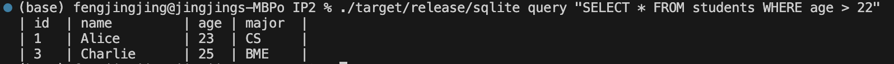

# jf361_ids706_ip1
[](https://github.com/siyiia/jf361_ids706_ip2/actions/workflows/RustCI.yml)

### Video Link
[Watch the video here]()

## Project Introduction
This project is about Rust CLI Binary with SQLite

## Project Structure
```angular2html
project/
├── .github/
│   └── workflows/
│       └── RustCI.yml
│
├── src/
│   ├── lib.rs
│   └── main.rs
│
├── Makefile
├── Cargo.toml
├── README.md
```

## Project Description
This project is a command-line interface (CLI) tool written in Rust to manage a simple SQLite database. It allows users 
to perform operations such as creating tables, inserting records, updating records, and executing custom SQL queries.

## Project Features
- Create Table: Initializes a new table in the SQLite database. 
- Insert Record: Adds a new entry to the table. 
- Update Record: Modifies an existing entry based on specified criteria. 
- Delete Record: Deletes a specific entry. 
- Delete Table: Deletes a specific table. 
- Execute SQL Query: Executes custom SQL commands on the database.

## Project Dependencies
The project is built with Rust and relies on the following dependencies:
- rusqlite: For interfacing with SQLite databases. 
- clap: For handling command-line arguments and subcommands.

## Project Usage
### 1. Clone the Repository
```
git clone https://github.com/siyiia/jf361_ids706_ip2.git
cd jf361_ids706_ip2
```
### 2. Build the Project
Compile the project in release mode to create an optimized binary:
```
cargo build --release
```
The compiled binary will be located at target/release/sqlite.
### 3. Running the Program
You can run the CLI tool directly from the command line. Here are the main commands:
1. Create a Table:
   ```
   ./target/release/sqlite create_table
   ```
   Screenshot of successfully perform **Create a Table**
   <p>
     
   </p>
2. Insert a Record:
   ```
   ./target/release/sqlite create <id> <name> <age> <major>
   ```
   Screenshot of successfully perform **Insert a Record**
   <p>
     
   </p>
3. Read a Specific Record:
   ```
   ./target/release/sqlite read <id>
   ```
4. Read All Records:
   ```
   ./target/release/sqlite read
   ```
   Screenshot of successfully perform **Read a Specific Record** and **Read All Records**
   <p>
     
   </p>
5. Update a Record:
   ```
   ./target/release/sqlite update <id> <column> <new_value>
   ```
   Screenshot of successfully perform **Update a Record** for **Age** column
   <p>
     
   </p>
   
   Screenshot of successfully perform **Update a Record** for **Major** column
   <p>
     
   </p>
6. Delete a Record:
   ```
   ./target/release/sqlite delete_row <id>
   ```
   Screenshot of successfully perform **Delete a Record**
   <p>
     
   </p>
7. Delete a Table:
   ```
   ./target/release/sqlite delete_table
   ```
   Screenshot of successfully perform **Delete a Table**
   <p>
     
   </p>
8. Execute a SQL Query:
   ```
   ./target/release/sqlite query "<SQL query>"
   ```
   Screenshot of successfully perform **Execute a SQL Query**
   <p>
     
   </p>

## LLM Usage
Since I am not familiar with Rust, I used ChatGPT to help translate my ideas into functional code.
Additionally, when I encountered errors, I asked it to give me solutions.